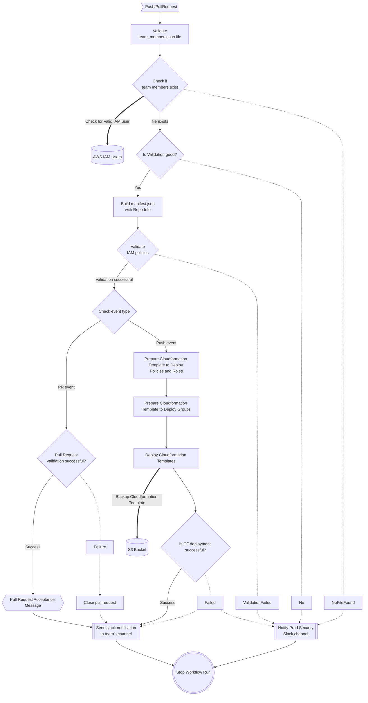

```mermaid
  flowchart TD;
      Start>Push/PullRequest]--> A[Validate \n team_members.json file];
      A --> A1{Check if \n team members exist} == Check for Valid IAM user ==> A2[(AWS IAM Users)];
      A1 -- file exists --> B{Is Validation good?};
      A1 -.- NoFileFound -.-> D[[Notify Prod Security \n Slack channel]];
      B -- Yes --> C[Build manifest.json \n with Repo Info];
      B -.- No -.-> D;
      C --> G{Validate \n IAM policies};
      G -- Validation successful --> G1{Check event type};
      G -.- ValidationFailed -.-> D;
      G1 -- PR event--> I{Pull Request \n validation successful?};
      I -- Success --> Msg{{Pull Request Acceptance Message }} --> J[[Send slack notification \n to team's channel]];
      I -.- Failure -.-> K[Close pull request]-.->J;
      G1 -- Push event --> G2[Prepare Cloudformation Template to Deploy Policies and Roles];
      G2 --> G3[Prepare Cloudformation Template to Deploy Groups];
      G3 --> G4[Deploy Cloudformation Templates] == Backup Cloudformation Template ==> H1[(S3 Bucket)];
      G4 --> G41{Is CF deployment successful?}
      G41 -- Success --> J
      G41 -.- Failed -.-> J & D --> Z(((Stop Workflow Run)));
```
